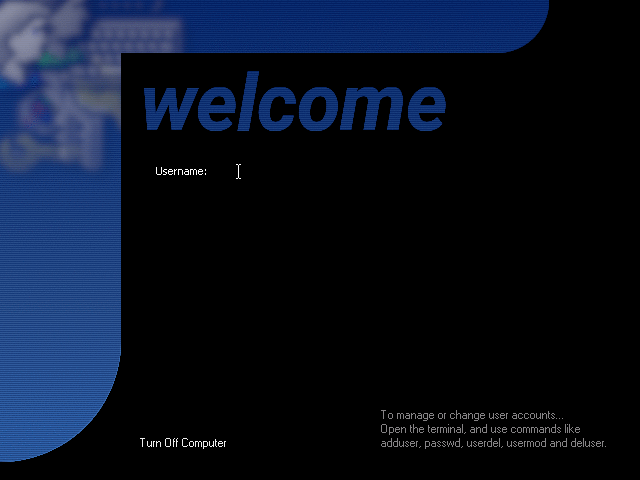

# xdm-retro-theme
Retro looking XDM theme

# What is this based on?
https://www.reddit.com/r/unixporn/comments/129fn1z/xenodm_openbsd_grayscale_login/

# What does it require?
xdm (of course), pkill, ImageMagick, Wine Tahoma font, xclock, xmessage, xsetroot

# How does it look?

# What are the icons from at the corner image?
https://github.com/nestoris/Win98SE

# License?
License for the code I made doesn't have any. Do whatever you want with it, however I am not responsible for any damages.  
The icons in the corner image are GPLv2 (linked above).  
I assume the code I forked from has no license either, since it didn't come with any.

# Documented issues with fixes
**I log in and it goes straight back to xdm. Why???**  
Have you created a .xsession file in your home directory? Also make sure you do chmod 755 on Xstartup.
